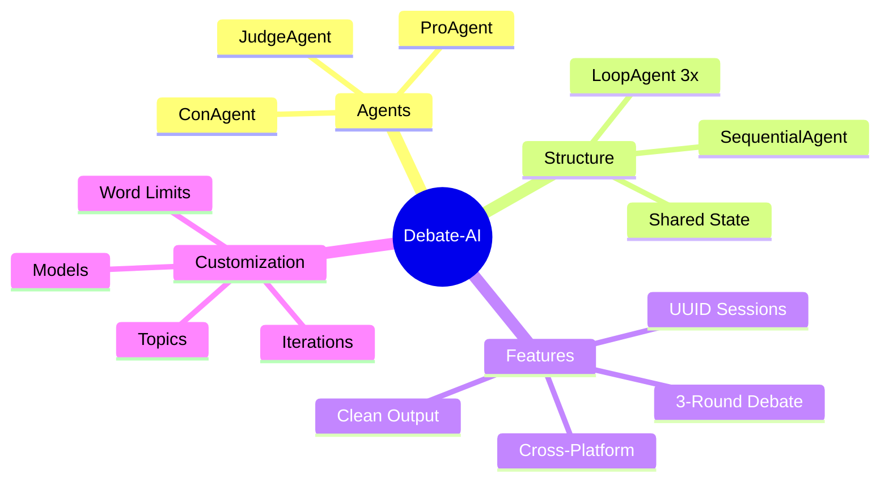
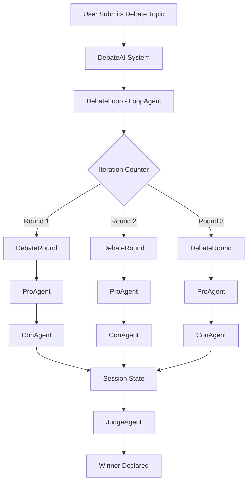
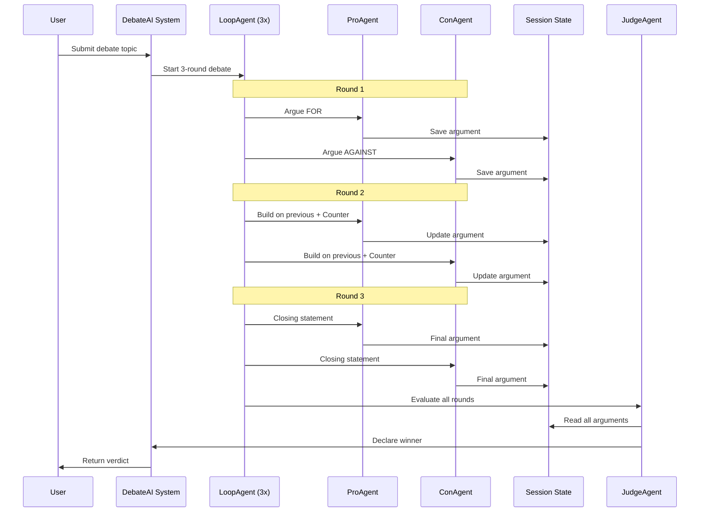
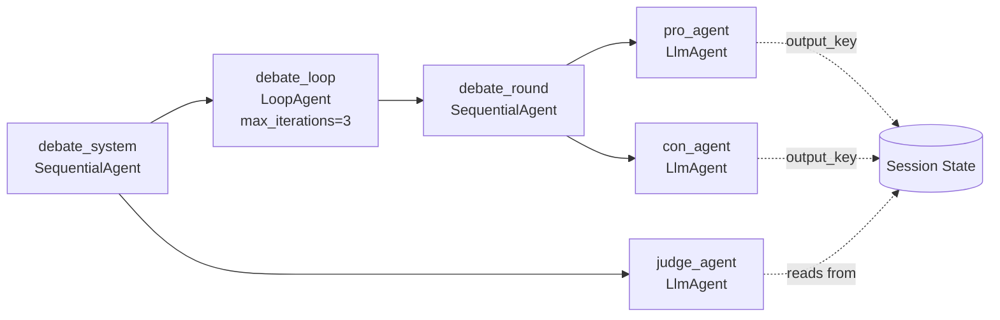
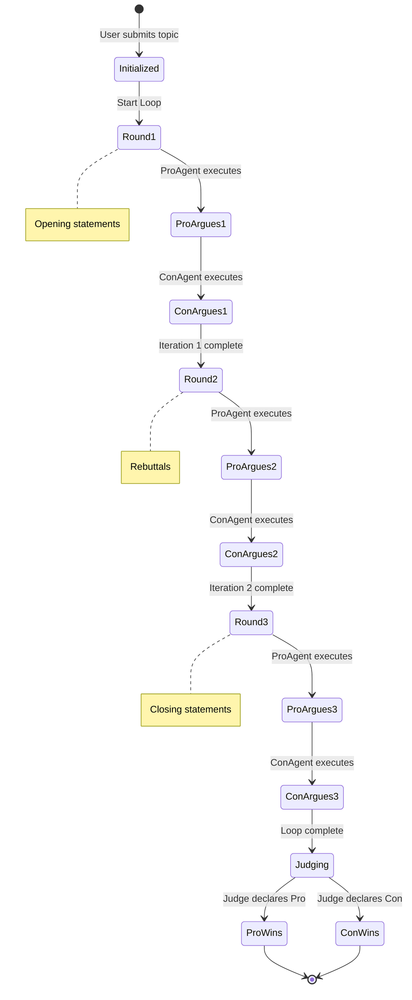
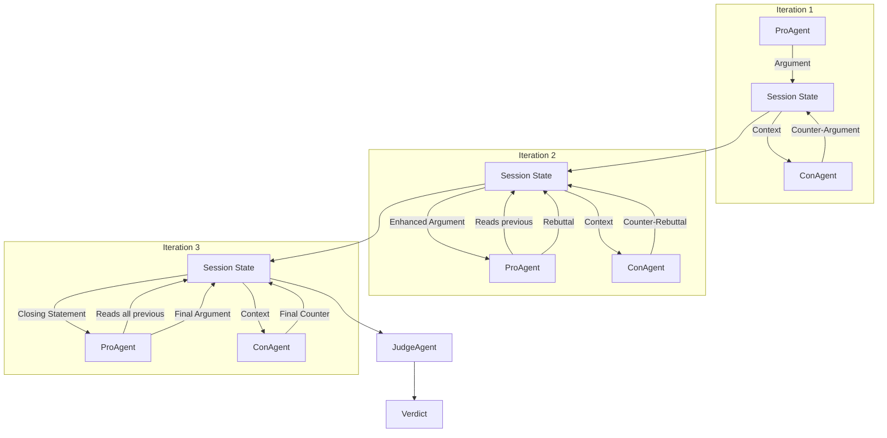

# Debate-AI System Diagrams

This document contains all the Mermaid diagrams used in the Debate-AI system documentation.

## 1. System Overview (Mind Map)

**Purpose:** High-level overview of system components and features

---

## 2. Architecture Diagram (Graph)

**Purpose:** Shows how the LoopAgent executes 3 iterations and feeds into the Judge

---

## 3. Sequence Diagram (Workflow)

**Purpose:** Shows the temporal sequence of agent interactions across 3 rounds

---

## 4. Component Structure (Graph)

**Purpose:** Shows the hierarchical structure of agents and their relationships

---

## 5. Data Flow Diagram

```mermaid
flowchart LR
    A[Debate Topic] --> B{DebateAI}
    B --> C[Round 1]
    B --> D[Round 2]
    B --> E[Round 3]
    
    C --> C1[Pro: Opening]
    C --> C2[Con: Opening]
    
    D --> D1[Pro: Rebuttal]
    D --> D2[Con: Rebuttal]
    
    E --> E1[Pro: Closing]
    E --> E2[Con: Closing]
    
    C1 & C2 & D1 & D2 & E1 & E2 --> F[Judge]
    F --> G{Winner}
    
    G -->|Pro Wins| H[✅ Pro]
    G -->|Con Wins| I[✅ Con]
```

**Purpose:** Shows how data flows from input through rounds to final verdict

---

## 6. State Management Diagram

**Purpose:** Shows the state transitions throughout the debate lifecycle

---

## 7. Agent Interaction Pattern

**Purpose:** Shows how agents interact with shared state across iterations

---

## 8. Simplified Flow (For Presentations)

```mermaid
graph LR
    A[📝 Topic] --> B[🔁 Loop 3x]
    B --> C[🔵 Pro]
    B --> D[🔴 Con]
    C & D --> E[⚖️ Judge]
    E --> F[🏆 Winner]
```

**Purpose:** Simple, high-level flow for quick understanding
